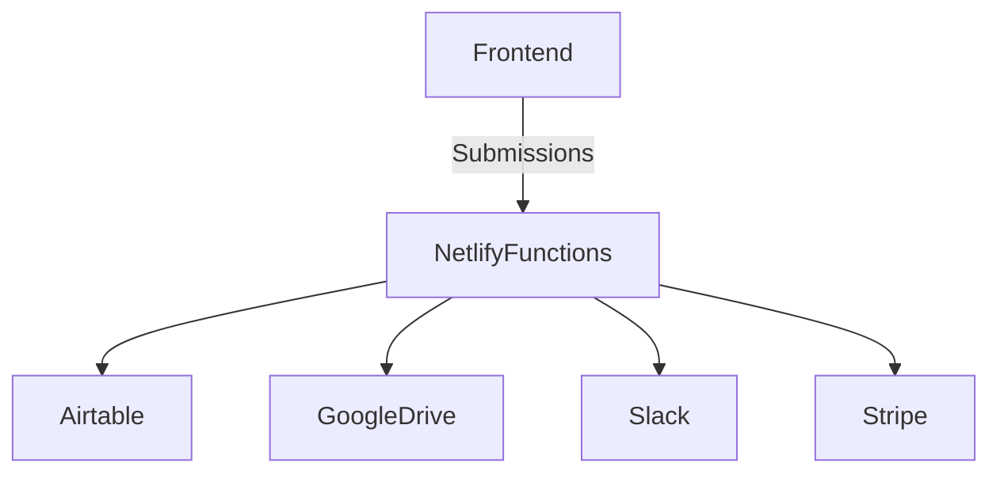

# ColumbiaPA300 - Integrations Overview

## 🎯 Purpose

ColumbiaPA300 integrates with several **third-party services** to enable its civic platform features.  
These integrations powered **payments, submissions, storage, and real-time notifications**.

---

## 🔑 Airtable (Database)

- **Purpose:** Store logo submissions and votes
- **Integration:**  
  - Netlify Functions (`submitForm.js`, `submit-vote.js`)  
  - API key and Base IDs pulled from environment variables  
- **Stored Data:**  
  - Submissions: name, email, school, grade, file reference  
  - Votes: voter info + logo selections  
- **Risks:**  
  - Vendor lock-in (API + pricing model)  
  - Contains PII (must be handled carefully, see `SECURITY.md`)

---

## 🔑 Google Drive (File Storage)

- **Purpose:** Store uploaded files (logos, media, documents)  
- **Integration:**  
  - Service account credentials (base64-encoded in `.env`)  
  - Functions: `submitForm.js`, `mediaUpload.js`, `createResumableUpload.js`  
- **Features:**  
  - Direct uploads for small files (<10MB)  
  - Resumable uploads for large media (>10MB)  
  - Separate Drive folders for **logos, images, videos, docs**  
- **Risks:**  
  - Arbitrary file upload risks  
  - Folder IDs must remain secret (not exposed in repo)

---

## 🔑 Stripe (Payments)

- **Purpose:** Enable donations (one-time + recurring)  
- **Integration:**  
  - Netlify Function: `create-checkout-session.js`  
  - Uses `STRIPE_SECRET_KEY` + publishable key for frontend  
  - Donation tiers ($25, $100, $250, $500) + custom amounts  
  - Redirects to `/thank-you` page on success  
- **Features:**  
  - Recurring billing supported  
  - Tiered sponsor messaging  
- **Risks:**  
  - PCI compliance handled by Stripe Checkout (not stored locally)  
  - Keys must not be leaked in repo

---

## 🔑 Slack (Notifications)

- **Purpose:** Real-time alerts for submissions & uploads  
- **Integration:**  
  - Webhook URL (`SLACK_WEBHOOK_URL`)  
  - Functions: `submitForm.js`, `notifySlackResumable.js`  
- **Events Sent:**  
  - New logo submission (with metadata)  
  - New media upload (file details)  
- **Risks:**  
  - Webhook URL is sensitive - must not be exposed in repo

---

## 📋 Integration Data Flow

## ⚡ Integration Strengths

Real-world, production-grade APIs (Stripe, Airtable, Drive, Slack)

Clear separation of concerns (payments, storage, alerts)

Minimal server management (all via Netlify Functions)